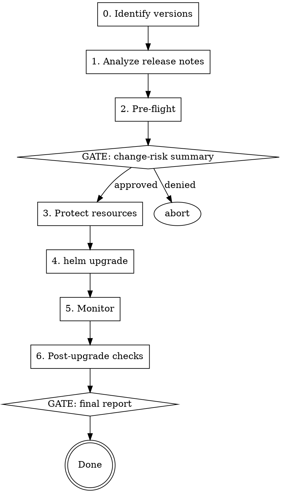

# Cozystack Upgrade

Guided upgrade of a running Cozystack v1.x cluster. Source of truth: `https://cozystack.io/docs/v1/operations/cluster/upgrade/`.

## Core principle

**Release-notes-driven upgrade.** Every release changes a specific set of components. Generic "all green" checks miss regressions in the areas that actually changed. Read the target's release notes, extract the change list, and run targeted pre/post checks — not just the default health checklist.

## Workflow



## Stop gates (non-negotiable)

Request explicit user approval before each. Prior approval does NOT carry forward.

1. **Any mutating command** — show exact command first.
2. **The `helm upgrade` itself** — show current→target version, chart version, change-risk summary.
3. **Deleting any resource** (old ConfigMaps, orphan HRs, helm release secrets).
4. **Patching `Tenant`, `TenantControlPlane`, or `sh.helm.release.v1.*` secrets** — see `references/known-failures.md` for why.

## Steps

### Step 0 — Identify versions

```bash
kubectl -n cozy-system get deployment cozystack-operator \
  -o jsonpath='{.spec.template.spec.containers[0].image}{"\n"}'
kubectl get packages.cozystack.io cozystack.cozystack-platform -o yaml   # bundle + values
```

If cluster is on v0.x, stop — this skill does not cover the v0→v1 migration.

Only stable (`vX.Y.Z`) releases are recommended for production. Avoid `-alpha/-beta/-rc` unless user explicitly asks.

### Step 1 — Analyze release notes (most important)

```bash
gh release list --repo cozystack/cozystack --limit 20
gh release view vX.Y.Z --repo cozystack/cozystack
```

Read notes for **every release between current and target**. Extract a change-risk summary (affected components, breaking changes, migrations, CRD bumps, dependency changes).

**How to analyze + change-signal mapping table:** read `references/release-notes-analysis.md`.

### Step 2 — Pre-flight checks

Any `False`, stuck, or suspended resource MUST be fixed before upgrading.

```bash
# Quick gate — anything here blocks the upgrade
bash <cozystack-repo>/hack/check-readiness.sh
```

**Full pre-flight command set** (including LINSTOR, Kube-OVN, tenant control planes, suspended flux resources, etcd): read `references/preflight-checks.md`.

### Step 3 — STOP GATE: change-risk summary

Show user: current→target version, change-risk summary from Step 1, pre-flight results, the exact upgrade command. Wait for explicit approval.

### Step 4 — Protect critical resources

Always run. Missing these annotations can delete `cozy-system` on upgrade.

```bash
kubectl annotate namespace cozy-system helm.sh/resource-policy=keep --overwrite
kubectl annotate configmap -n cozy-system cozystack-version helm.sh/resource-policy=keep --overwrite
```

### Step 5 — Upgrade

```bash
helm upgrade cozystack oci://ghcr.io/cozystack/cozystack/cozy-installer \
  --version X.Y.Z \
  --namespace cozy-system \
  --reuse-values
```

`--reuse-values` preserves cluster settings. Omit only if deliberately changing values (then pass `-f values.yaml` and review the resulting Package spec first).

### Step 6 — Monitor

```bash
kubectl logs -n cozy-system deploy/cozystack-operator -f
bash <cozystack-repo>/hack/check-readiness.sh -w 10
```

Expect: operator pod Running, `cozystack.cozystack-platform` Package `Ready=True`, all HRs converge within a few minutes (tenant charts may take longer).

### Step 7 — Post-upgrade checks

Run both general **and** targeted-per-change checks from Step 1.

**General + targeted check commands + tenant cluster sanity:** read `references/post-upgrade-checks.md`.

### Step 8 — STOP GATE: final report

Show user: result (success/partial/failed), before→after version, HR/Package totals, any warnings, one-line outcome per targeted check.

## Rollback

`helm rollback cozystack <rev> -n cozy-system` is possible but has caveats (data migrations don't reverse). Before rolling back, snapshot: `kubectl get packages.cozystack.io -A -o yaml > pre-rollback.yaml`.

**Details, caveats, when not to roll back:** read `references/rollback.md`.

## Known failure modes

High-blast-radius stuck states — stuck helm `uninstalling`, Kamaji datastore cert mismatch, `MissingRollbackTarget`, orphan HRs from removed apps, `cozy-system` accidentally deleted, etc.

**Before any of these mitigation paths, read `references/known-failures.md`.** Each entry has a root cause and exact recovery commands.

## Red flags during upgrade

| Symptom | Likely cause |
|---|---|
| `Package.Ready=False, ValidationFailed` | Release tightened `values.schema.json`; fix Package before proceeding |
| HR `Ready=False, ExternalArtifact ... not found` | App removed in target version → orphan HR (known-failures #6) |
| `cozystack-operator` in CrashLoopBackOff | Stale CRD / RBAC; `kubectl logs -n cozy-system deploy/cozystack-operator --previous` |
| HR `UninstallFailed, failed to delete release` | Stuck helm history (known-failures #1) |
| TCP `INSTALLED VERSION` diverges from `VERSION` | Kamaji upgrade stuck (known-failures #4) |
| `cozy-system` namespace gone | Missing `helm.sh/resource-policy=keep` (known-failures #7); restore from backup |
| Mass `kubevirt-evacuation-*` VMIMs in `Failed`, `qemu-kvm: error while loading state ... virtio-net` | KubeVirt upgrade crossed the QEMU bump (1.6.x → 1.7+); pre-existing VMs need cold-restart (known-failures #8) |

## KubeVirt 1.6.x → 1.8.x special handling

If Step 1's release-notes analysis shows the target Cozystack version bumps KubeVirt from 1.6.x to 1.7+ (currently 1.8.2 in `release-1.4`), live-migration of every running VM will fail until those VMs are cold-restarted. This is [kubevirt/kubevirt#16386](https://github.com/kubevirt/kubevirt/issues/16386).

**Apply the pre-/post-upgrade workflow in `references/known-failures.md` #8 before and after `helm upgrade`.** It disables `workloadUpdateMethods` first so the operator doesn't trigger a flapping evacuation loop, then drives a paced cold-restart of all running VMs.

Coordinate with VM owners ahead of time: every VM (except explicit opt-outs) gets one ~30-60s downtime during the restart loop. Tenants who can't take that window should be added to the exclusion list; their VMs will keep running on the old QEMU until they restart them themselves.

## Common mistakes

- Skipping release-notes analysis → regressions in changed areas go unseen.
- Upgrading while HRs are suspended → those stay on old chart versions silently.
- `helm upgrade` without `--reuse-values` → drops cluster-specific settings.
- Patching `Tenant/*.spec.etcd=false` to "clean up" → removes tenant etcd, breaks child kube clusters. See known-failures #2.
- Deleting helm release secrets without suspending the HR first → helm-controller races with you.
- Installing a pre-release in production without explicit user direction.

## References

- Skill files: `references/release-notes-analysis.md`, `references/preflight-checks.md`, `references/post-upgrade-checks.md`, `references/rollback.md`, `references/known-failures.md`
- Upstream: `https://cozystack.io/docs/v1/operations/cluster/upgrade/`
- Troubleshooting checklist: `https://cozystack.io/docs/v1/operations/troubleshooting/#troubleshooting-checklist`
- Releases: `https://github.com/cozystack/cozystack/releases`
- Readiness script: `<cozystack-repo>/hack/check-readiness.sh`
